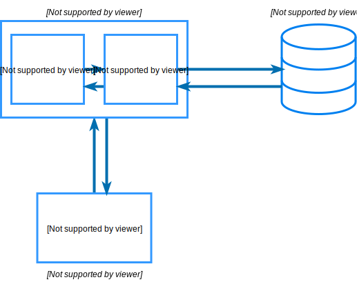
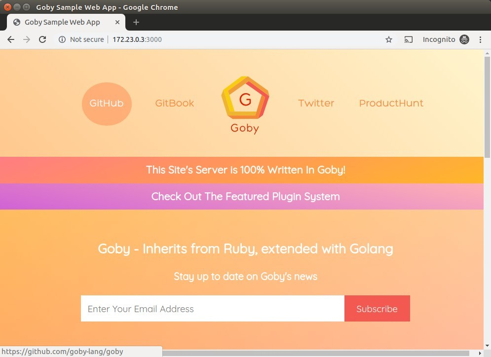
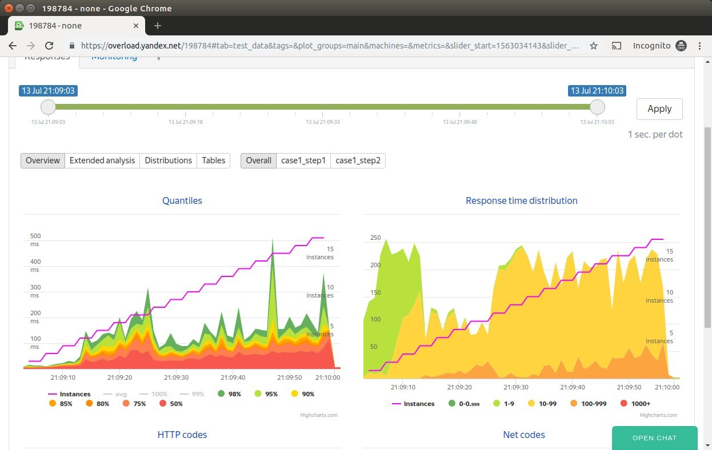
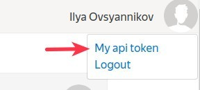

# lt-workshop
Load testing workshop project.

Проект-песочница для ознакомления с нагрузочным тестированием.

## Архитектура


Конфигурация приложения описана в [docker-compose.yml](./docker/docker-compose.yml). В качестве веб-сервиса используется [goby-lang/sample-web-app](https://github.com/goby-lang/sample-web-app)

## Установка
Чтобы начать пользоваться проектом нужно установить Docker. Docker - это набор инструментов изолированного запуска программ, которые написаны для ОС Linux. Каждая программа (приложение) стартует в отдельном Docker-контейнере, которым можно управлять командами из терминала. Инструкции по установке для

- [Windows 10](https://docs.docker.com/docker-for-windows/install/)
- [Windows 7, 8](https://docs.docker.com/toolbox/toolbox_install_windows/). Вместе с Docker Toolbox будет установлен Virtualbox
- [Mac OS](https://docs.docker.com/docker-for-mac/install/)
- [Linux](https://docs.docker.com/install/linux/docker-ce/ubuntu/#install-docker-ce-1). Дополнительно нужно установить [docker-compose](https://docs.docker.com/compose/install/)

Также нужно склонировать этот репозиторий к себе. Если у вас не установлена система контроля версий Git, выполните установку [по ссылке](https://git-scm.com/book/en/v2/Getting-Started-Installing-Git).

Желательно, чтобы был установлен удобный текстовый редактор, например, [VS Code](https://code.visualstudio.com/).

### Дополнительно, если у вас Windows
Перед клонированием репозитория выполните
``` bash
git config --global core.autocrlf false
```

На Windows 10 при запуске Docker Desktop может быть ошибка **Docker failed to initialize**.
В этом случае выполните [Шаг 4 из инструкции](https://docs.microsoft.com/en-gb/windows/wsl/install-win10#step-4---download-the-linux-kernel-update-package)
для обновления Windows Subsystem for Linux (WSL).

На Windows 10 можно ограничить ресурсы Docker-хоста (например, оперативную память, CPU). Для этого:
1. Скопируйте файл `config/windows/.wslconfig` в свой домашний каталог.
2. Запустите терминал PowerShell от имени администратора и выполните ` wsl --shutdown`.


### Запуск
Запускаем Докер. В терминале (для Windows - это программа PowerShell) переходим в каталог `docker` в этом репозитории. Команда `cd`. Пример для Windows
``` bash
cd C:\Users\developer\Documents\lt-workshop\docker 
```

Выполняем команды

``` bash
docker-compose up -d
```

Будут скачаны образы компонентов приложения и их контейнеры будут запущены в фоне

``` bash
Starting docker_postgres_1 ... done
Starting docker_influxdb_1 ... done
Starting docker_grafana_1  ... done
Starting telegraf          ... done
Starting docker_web_1      ... done
Starting docker_tank_1     ... done
Starting docker_k6_1       ... done
```

Когда контейнеры запустятся, можно открыть запущенное приложение в браузере. Обычно оно доступно на localhost-е.

http://localhost:3000 - веб-приложение.

http://localhost:3001 - Grafana.


Если `localhost` не работает, узнайте IP Docker-хоста в командной строке, выполнив

##### Windows
``` bash
ipconfig
```

##### Mac OS, Linux
``` bash
ifconfig
```

найдите в выводе IP, начинающийся на 192.168.. или 10...

Открываем в браузере на порту 3000: `http://<IP ADDRESS>:3000`. Должен открыться сайт



Приложение запущено.

## Использование
### Яндекс.Танк
Заходим в контейнер инструмента нагрузочного тестирования
``` bash
docker-compose exec tank bash
```

Должен быть примерно такой вывод
``` bash
Yandex.Tank Docker image
[tank]root@3cb5a857818d: /var/loadtest # 
```

Отсюда будем запускать тесты
``` bash
yandex-tank -c /data/load.yaml
```

Для остановки теста нажмите `Ctrl + C`. Для выхода из докер-контейнера выполните команду `exit`.


Графики результатов НТ загружаются на сервис [OverLoad](https://overload.yandex.net)



Для автоматической отправки метрик требуется получить токен. Для этого нужно авторизоваться [на странице сервиса](https://overload.yandex.net/login/) через аккаунт Яндекса или Гитхаба. Далее нажать на область с юзерпиком → My api token. Значение токена нужно поместить в файл `token.txt` в этом каталоге.



### k6
Заходим в контейнер инструмента нагрузочного тестирования
``` bash
docker-compose exec k6 sh
```

Отсюда будем запускать тесты
``` bash
k6 run /data/k6-test.js
```

Для остановки теста нажмите `Ctrl + C`. Для выхода из докер-контейнера выполните команду `exit`.

### Grafana
Открываем в браузере на порту 3001: `http://<IP ADDRESS>:3001`.
В Графане доступны 3 дашборда:
- Yandex tank - для мониторинга тестов Яндекс.Танка
- k6 Load Testing Results - для мониторинга тестов k6
- Telegraf: system dashboard - для просмотра используемых ресурсов докер-хостом


### Полезные команды
#### Внутри контейнера

Узнаем размер доступной оперативной памяти
``` bash
free -h
```

Узнаем объем использования дисков
``` bash
df -h
```

#### В среде запуска Докера
Проверяем, что все контейнеры запущены 
``` bash
docker-compose ps
```
State должен быть `Up`.
``` bash
        Name                 Command         State          Ports       
------------------------------------------------------------------------
ltworkshop_postgres_   docker-               Up      0.0.0.0:32768->5432
1                      entrypoint.sh                 /tcp               
                       postgres                                         
ltworkshop_tank_1      /bin/sh -c            Up                         
                       /tmp/startup.sh                                  
ltworkshop_web_1       /bin/sh -c service    Up      0.0.0.0:52022->22/t
                       ssh sta ...                   cp, 0.0.0.0:3000->3
                                                     000/tcp 

```

Перезапускаем контейнер `web` после изменения конфигурации в `docker-compose.yml`
``` bash
docker-compose up -d web
```

Смотрим потребление ресурсов контейнерами
``` bash
docker stats
```

Останавливаем все контейнеры
``` bash
docker-compose stop
```

## Прочее

[Примеры результатов тестов](./docs/tests-analytics.md).

### Ссылки

- [Документация Яндекс.Танка](https://yandextank.readthedocs.io/en/latest/index.html)
- [Видео докладов про НТ](https://events.yandex.ru/lib/talks/?tech=tank) и [еще](https://www.youtube.com/watch?v=1idebTeMTqY)
- [Обзор инструментов НТ](https://geteasyqa.com/ru/blog/best-tools-load-testing/)
- [Список литературы по производительности](https://github.com/yandex/yandex-tank/wiki/%D0%A1%D0%BF%D0%B8%D1%81%D0%BE%D0%BA-%D0%BB%D0%B8%D1%82%D0%B5%D1%80%D0%B0%D1%82%D1%83%D1%80%D1%8B-%D0%BF%D0%BE-%D0%BF%D1%80%D0%BE%D0%B8%D0%B7%D0%B2%D0%BE%D0%B4%D0%B8%D1%82%D0%B5%D0%BB%D1%8C%D0%BD%D0%BE%D1%81%D1%82%D0%B8)